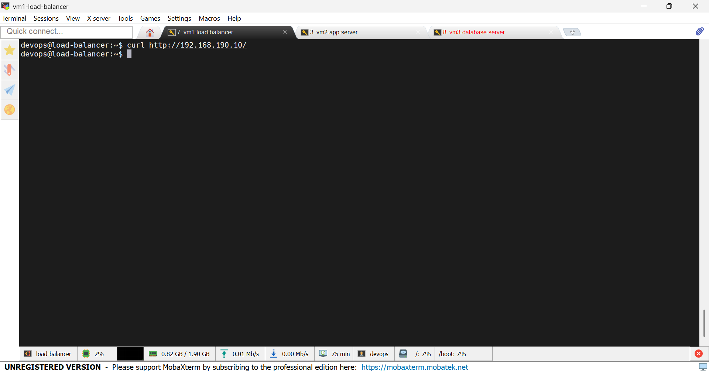
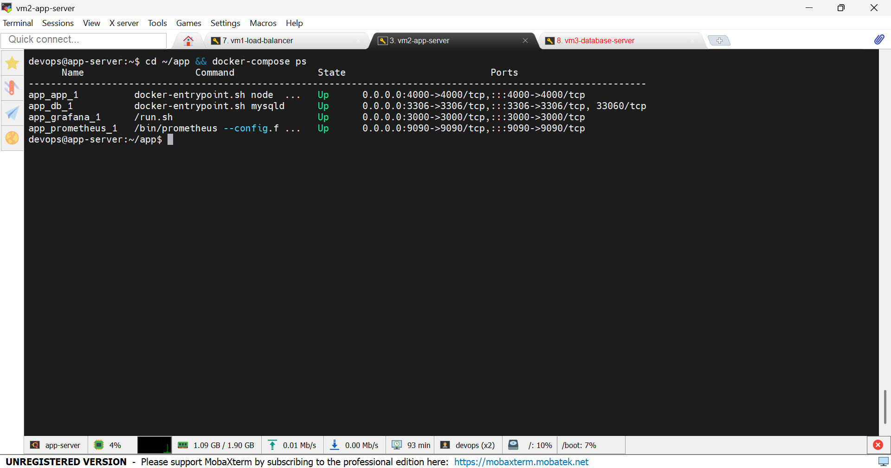
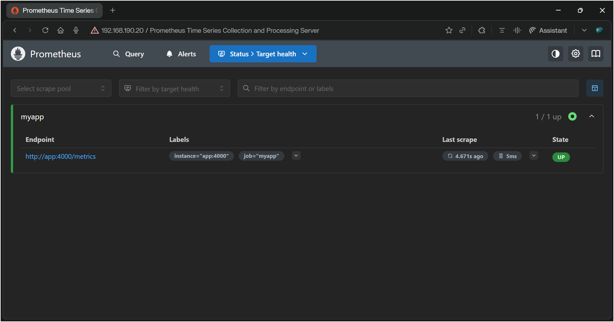
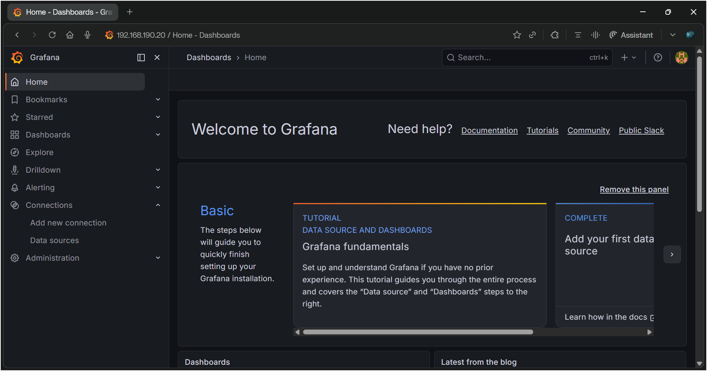

# DevOps Project - 3-Tier Architecture

A hands-on DevOps lab built on VMware with Ubuntu Server 22.04.
This project simulates a real company infrastructure with load balancing,
containerized apps, a database server, monitoring, and a CI/CD pipeline.

## What I Built

- A 3-tier architecture: Load Balancer → App Server → Database
- Containerized Node.js app with Docker and Docker Compose
- Nginx as a reverse proxy and load balancer
- MySQL database on a separate VM
- Monitoring stack with Prometheus and Grafana
- Automated CI/CD pipeline using GitHub Actions

## Architecture Diagram


## Project Flow
```
Client
  ↓
Nginx Load Balancer (VM1 - 192.168.190.10)
  ↓
Node.js App + Docker (VM2 - 192.168.190.20)
  ↓
MySQL Database (VM3 - 192.168.190.30)
  ↓
Prometheus + Grafana (Monitoring)
```

## Virtual Machines

| VM | Hostname | IP | Role |
|---|---|---|---|
| VM1 | load-balancer | 192.168.190.10 | Nginx |
| VM2 | app-server | 192.168.190.20 | Node.js + Docker |
| VM3 | database-server | 192.168.190.30 | MySQL |

## Tech Stack

| Tool | Purpose |
|---|---|
| VMware Workstation | Virtualization |
| Ubuntu Server 22.04 | OS for all VMs |
| Nginx | Load Balancer / Reverse Proxy |
| Node.js 18 | Backend Application |
| MySQL 8 | Database |
| Docker & Docker Compose | Containerization |
| Prometheus | Metrics Collection |
| Grafana | Monitoring Dashboard |
| GitHub Actions | CI/CD Pipeline |

## API Endpoints

- `GET /` → Returns Hello World
- `GET /metrics` → Prometheus metrics

## How to Run
```bash
git clone https://github.com/Ilyasshimi/devops-project.git
cd devops-project
docker-compose up -d
```

## Screenshots

### Nginx Load Balancer


### Docker Compose Services


### Prometheus Targets


### Grafana Dashboard


## What I Learned

- How to design and build a multi-server infrastructure
- How to use Docker and Docker Compose in production-like environments
- How to configure Nginx as a reverse proxy
- How to set up monitoring with Prometheus and Grafana
- How to automate builds with GitHub Actions
```
# CI/CD Pipeline added
